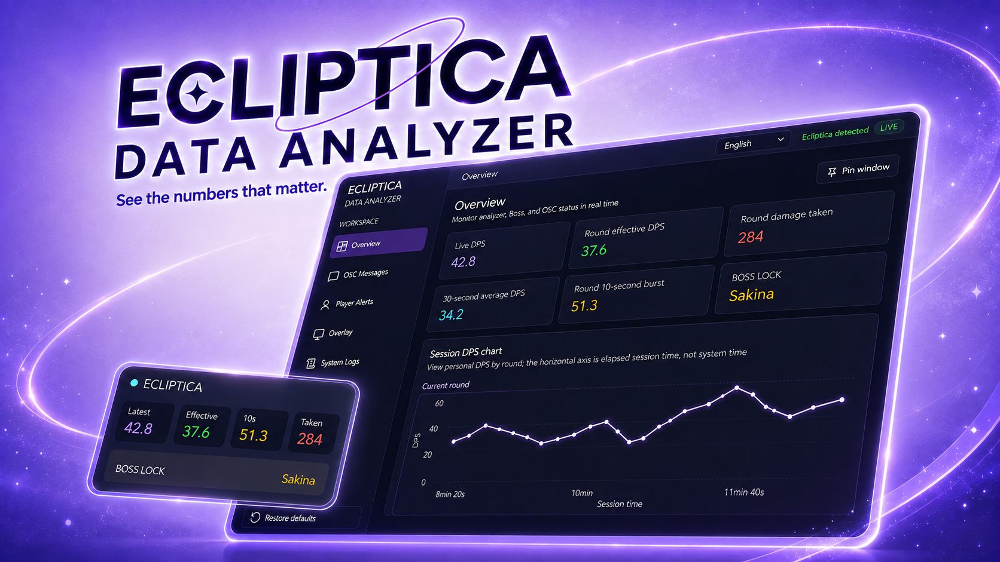

  

<h1 align="center">Ecliptica Data Analyzer</h1>

  A lightweight combat companion for Ecliptica in VRChat. 
  See the numbers that matter, including your DPS, damage taken, and who the Boss is targeting.

## Download

[Download the latest release](https://github.com/xn-sakina/ecliptica-data-analyzer/releases)

Download the Windows executable and open it. That is it. There is no installer, no setup wizard, and no bundled browser runtime. Delete the file whenever you no longer need it.

## Preview

## What it shows

Ecliptica Data Analyzer focuses on the combat signals that are useful but normally hidden:

* Live DPS and round performance
* Damage taken
* Boss target status
* Compact combat and round reports
* Optional VRChat OSC Chatbox updates
* A small always on top overlay

The app and its built in presets support both English and Chinese.

## Quick start

1. Download and open the executable.
2. Enter your VRChat display name in the app so it can tell when the Boss is targeting you.
3. Enter Ecliptica and play as usual. The app reads the local VRChat log and updates automatically.
4. To use Chatbox updates, enable OSC in the VRChat Action Menu.

## Why this app

### Open source

Most Ecliptica companion apps are closed source. This one is open for review, so you can audit the code or build it yourself instead of trusting a black box.

### Native and portable

The app is built as a native desktop executable with a small memory footprint. It does not ship with a few hundred megabytes of Chromium. Your computer probably has enough Chrome processes already.

It runs as a single file and needs no installation. Open it when you need it. Delete it when you do not.

### Core signals only

More data does not always mean better data. You already know the map, stage, and Boss from the game. What you cannot easily see is your DPS, incoming damage, and the current Boss target. Those hidden signals are the focus here.

Keeping the scope tight also makes the analyzer more resilient. Every extra metric needs another log pattern, and every extra pattern can break when Ecliptica changes its logs. This app depends on fewer signals and is designed to fail gracefully. If one signal disappears, the related feature can become unavailable without taking down the rest of the app.

### Practical UI

The interface is native, compact, and built to stay out of the way. It may not win a design award, but it does its job without hiding a full web browser under the hood.

## Contributing

The app is still growing and may have rough edges. Pull requests are welcome. See the [development guide](DEVELOPMENT.md) to get started.

## Disclaimer

This project is provided for learning and research only. It is an unofficial community tool and is not affiliated with or endorsed by VRChat or the Ecliptica team. Log formats and game behavior can change at any time, so data may become incomplete or inaccurate. Use the software at your own risk and follow the rules of the platforms and communities you use.

## License

MIT
